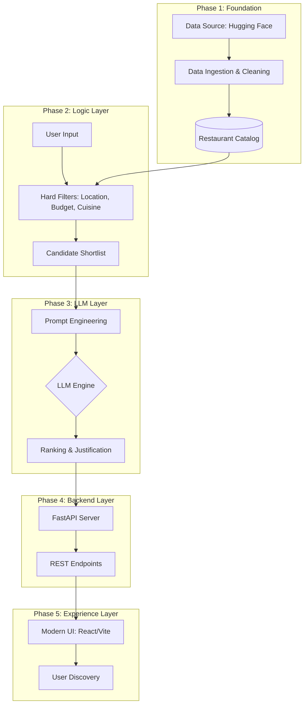

# 🏗️ Phase-Wise Architecture: Zomato AI Recommendation System

This document outlines the evolutionary roadmap for building the AI-powered restaurant recommendation engine. Each phase is designed to be independent yet cumulative, ensuring a robust and scalable implementation.

---

## 🗺️ Architectural Overview

---

## 🛠️ Phase 1: Data Ingestion & Catalog Foundation
**Goal**: Build a clean, queryable source of truth.

*   **Ingestion**: Stream/Download `ManikaSaini/zomato-restaurant-recommendation` from Hugging Face.
*   **Normalization**: 
    *   Map `price_range` to intuitive labels (Low, Medium, High).
    *   Standardize city and cuisine names for fuzzy matching.
*   **Persistence**: Store in a lightweight format (JSONL or SQLite) to avoid redundant network calls.
*   **Success Metric**: A module that can return a clean list of restaurants for any given city.

---

## ⚙️ Phase 2: Contextual Filtering & Shortlisting
**Goal**: Reduce the noise and prepare the signal for the LLM.

*   **Hard Filtering**: Implement deterministic logic for `Location`, `Cuisine`, `Budget`, and `Min Rating`.
*   **Heuristic Ranking**: If candidates exceed the token window (e.g., >20), pre-rank by rating/review count to select the top N candidates.
*   **Context Packaging**: Convert filtered rows into a compact JSON string to be injected into the prompt.
*   **Success Metric**: Inputting "Italian in Bangalore under 1000" returns a manageable list of ~10 candidates.

---

## 🧠 Phase 3: LLM Orchestration & Prompting
**Goal**: Transform structured data into "human" intelligence.

*   **Prompt Design**: 
    *   **System Prompt**: Roles and constraints (e.g., "You are a local food expert...").
    *   **User Prompt**: Dynamic injection of preferences + candidate set.
*   **Inference**: Integrate with Gemini 1.5 Pro or GPT-4o.
*   **Reasoning**: Instruct the model to compare candidates and explain why they fit the user's specific "vibe."
*   **Success Metric**: LLM returns a ranked list with unique, non-generic justifications for each restaurant.

---

## ⚙️ Phase 4: Backend Infrastructure (API Layer)
**Goal**: Centralize logic into a robust, high-performance server.

*   **Framework**: Implement **FastAPI** for low-latency asynchronous processing.
*   **Endpoints**:
    *   `POST /recommend`: Accepts user preferences and returns ranked AI recommendations.
    *   `GET /meta/locations`: Returns a list of available locations from the catalog.
*   **Pipeline Integration**: Connect the Phase 1 catalog, Phase 2 filters, and Phase 3 Groq engine into a unified service.
*   **Success Metric**: A functional REST API that responds to queries in <2 seconds.

---

## 📱 Phase 5: Experience Layer (Frontend)
**Goal**: Deliver a premium, interactive food discovery interface.

*   **Tech Stack**: **React** (via Vite) with **Vanilla CSS** or **Tailwind** for high-end styling.
*   **Dynamic Interface**:
    *   **Smart Search**: Auto-suggestions for locations and cuisines.
    *   **Result Cards**: Visual cards showing restaurant details and **AI-generated justifications**.
    *   **State Management**: Handle loading skeletons, empty states (no matches), and API errors gracefully.
*   **Success Metric**: A user can discover their next meal through a beautiful, responsive web interface.

---

## 🧪 Phase 6 (Future): Evaluation & Optimization
**Goal**: Continuous improvement.

*   **Latency Monitoring**: Track and optimize LLM response times.
*   **Prompt Iteration**: Use A/B testing or LLM-as-a-judge to improve recommendation quality.
*   **Vector Search**: Move from hard filters to semantic search for "vibe-based" queries (e.g., "date night spots").

---

> [!TIP]
> **Key Strategy**: Always pass the most relevant 5-10 restaurants to the LLM. Passing the entire dataset is expensive and degrades model performance (Lost in the Middle phenomenon).
